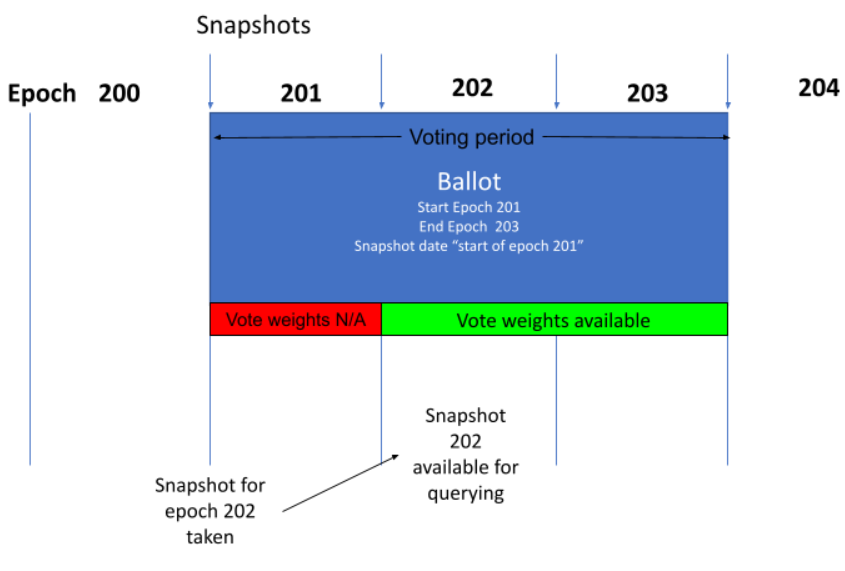
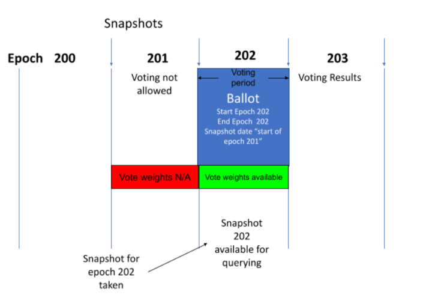
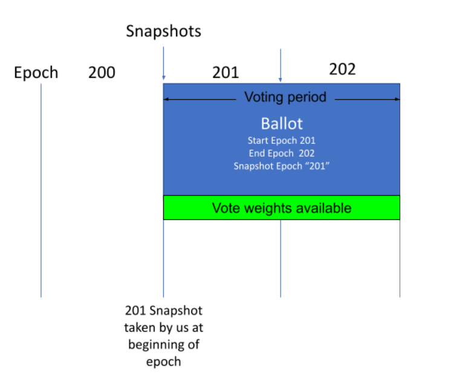

# Voteaire On-Chain Vote Schema

This repository contains the on-chain schema for the Voteaire voting platform. This specification should allow anyone with the technical know-how to validate vote results by querying the blockchain directly.

## Overview

Voteaire uses transaction metadata to store ballot proposals and votes immutably on the blockchain. This approach was pioneered by SPOCRA for their initial board of dirctors vote. Their repository can be found here: https://github.com/SPOCRA/onchain-voting

Voteaire extends this basic concept, adding multiple ballot types, and an easy to use interface for anyone to access and vote just by connecting their wallet. 

JSON schemas are contained within the schemas directory and describe the format of the metadata stored on-chain. Voteaire uses the metadata key 1916 to store ballot proposals and votes. 1916 was selected as it was the first year in which women allowed to vote in Canada. 

The Voteaire specification is versioned, and is currently at version 1.0.1.

## Vote Counting
Before starting note that some conditions must be met for a vote to be valid. some of these are:
* The wallet ***must be staked*** in order for votes to be valid.
* If a user submits multiple votes, only the first one will count.
* Vote must be submitted as part of a delegation transaction.
    * Note: Voteaire will re-delegate to the same pool you are currently delegated to, so there will be no impact on your delegation status or your rewards.

Voteaire offers three types of polls, the votes in each of these behave differently and are weighted depending on different factors, these are:

1. **Simple:** Allows you to create polls that anyone (with staked ADA) can vote on, the weight of each vote is based on the amount of ADA staked on the voting wallet.

2. **Delegated:** This type of poll is specifically for stake pool operators and their delegators; it allows you to create a poll using the stake pool ID, here the votes will be weighted proportionally to the amount of delegation to said pool. 

3. **policyID:** This poll uses a specific policy ID to allow voting, the weight of the vote is based on the number of tokens (with matching policy ID) held by the voting wallet. Note that the specification allows for multiple policy ids, however the UI only supports single policy ids per vote currently.

## Voting period
The voting period is the time during which voters can cast their votes, Voteaire uses the Cardano Epochs to establish the length of the voting periods, users can select the starting and ending epochs as they see fit.

### Snapshot Dates
In the Cardano blockchain ledger snapshots are taken at the beginning of every epoch to keep track of the stake distribution on the chain. Voteaire uses these snapshots to weight  the votes for the **simple** and **delegated** polls, however policy ID polls use snapshots taken directly by us.

The snapshot date tells Votaire what snapshot to use in order to weight the votes for a particular poll, this date can be any time up to the beginning of the ballot.

### Snapshot Epochs
To avoid confusion, the Voteaire front end only displays snapshot dates, however the underlying JSON uses snapshot epochs.

Let’s look at an example of how a poll is affected depending on the voting period and the snapshot epoch.
For this example we assume a poll (simple or delegated) that has a voting period starting at epoch 201 and ending at epoch 203, with a snapshot epoch of 202. Now let’s look at a sequence of events that take place during that time in the next image:

1. At the beginning of epoch 201 the voting period starts, meaning that participants can cast their votes, at the same time the snapshot for the next epoch (202) is taken but it’s not made available immediately so the votes can be counted but they cannot be weighted since we can’t query the snapshot data.
2. At the beginning of epoch 202 the snapshot becomes available for querying and it allows Voteaire to weight the votes. From now on the results and weights of the votes can be calculated in real time.
3. At the end of epoch 203 the voting period has ended, no more votes will be accepted and the results are final.

**Note:** in order for vote weighting to be available during the entire duration of the voting period it would be necessary to set the snapshot date to at least one epoch before the start of the voting period. See example below:

Now let’s  look at a similar case using a policy ID poll, in this case our voting period starts at epoch 201 and ends at epoch 202 using a snapshot taken in epoch 201

In this case we are taking the snapshot ourselves, so as soon as we are finished we can start weighing and counting the votes.

### Franken-Address Vulnerability 

Cardano addresses are composed of two parts, a payment portion and a staking portion. Typically the staking portion and payment portion of an address are from the same wallet and controlled by the same person, however it’s possible to compose an address of a payment portion under your control, and a staking portion owned by somebody else. 

The Franken-Address Vulnerability affects this platform because we weigh the votes using the ADA that a given stake address controls. So a malicious user may compose an address using someone else’s stake address who has a lot of ADA (or tokens) and vote using that address, since a simple transaction only requires a signature from the payment portion of an address. In this case they could unfairly change the result of an proposal by getting credit for ADA or tokens which they do not control. 

In order to ensure security and guarantee that the person voting actually controls the stake key which is casing the vote, we have updated the specification to require that votes need to be attached to a delegation transaction instead of a normal payment transaction. Because a delegation transaction requires control of the stake address this ensures that the voter cannot misrepresent the amount of funds they control.

The Voteaire application will look for the pool you are currently delegated to and re-delegate to that pool, and thus voting will not change your delegation status and will have no effect on rewards. Note, that you still must be delegated to a pool before casting a vote on the Voteaire platform.